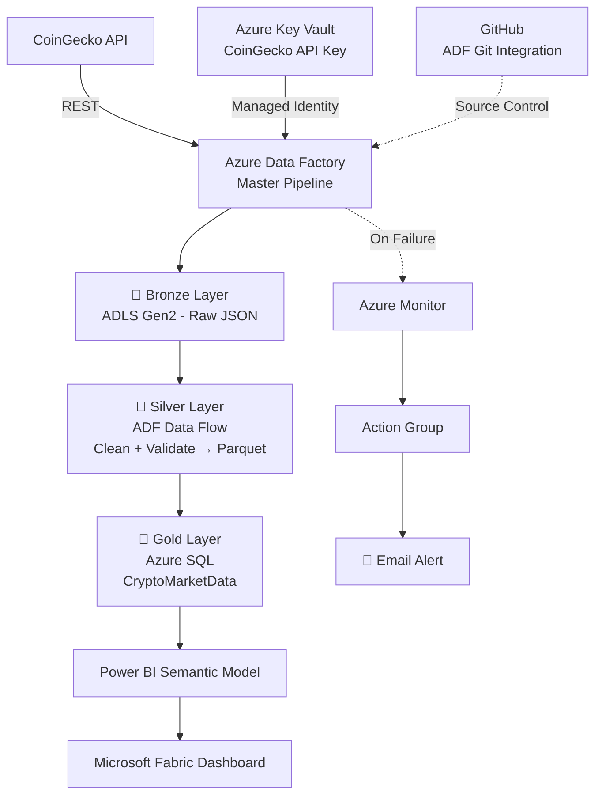

# 🚀 CoinGecko Crypto Data Engineering Pipeline

An end-to-end **Azure Data Engineering project** that ingests cryptocurrency market data from the CoinGecko API, processes it through a Bronze/Silver/Gold medallion architecture, stores curated data in Azure SQL Database, and visualizes it via Power BI published to Microsoft Fabric.

---

## 📌 Overview

This project demonstrates a real-world cloud data pipeline that:

- Extracts crypto market data from the CoinGecko REST API
- Lands raw data in Azure Data Lake Storage Gen2 (Bronze)
- Cleans and validates data using ADF Mapping Data Flows (Silver)
- Loads curated data into Azure SQL Database (Gold)
- Visualizes insights in Power BI, published to Microsoft Fabric
- Secures API credentials with Azure Key Vault + Managed Identity
- Runs on an automated daily schedule with Azure Monitor failure alerts
- Is version-controlled via ADF's native GitHub integration

---

## 🏗️ Architecture

---

## 🛠️ Tech Stack

| Technology | Purpose |
|---|---|
| CoinGecko API | Source of crypto market data |
| Azure Data Factory | Ingestion, orchestration, transformation |
| ADLS Gen2 | Bronze & Silver storage |
| Azure SQL Database | Gold/curated storage |
| Azure Key Vault | Secure API key storage |
| Managed Identity | Secure service-to-service auth |
| Power BI + Microsoft Fabric | Dashboard & reporting |
| Azure Monitor | Pipeline failure monitoring/alerts |
| GitHub | Source control (ADF Git integration) |

---

## 📂 Medallion Architecture

**🥉 Bronze** — Raw CoinGecko API JSON response, landed in ADLS Gen2 with minimal transformation, preserving source structure.

**🥈 Silver** — Cleaned via ADF Mapping Data Flow: select relevant columns → add ingestion timestamp → filter invalid records (e.g. `!isNull(id) && trim(id) != ''`) → write as Parquet.

**🥇 Gold** — Curated data loaded into `dbo.CryptoMarketData` in Azure SQL, including price, market cap, volume, 24h high/low/change, rank, and timestamps. A unique index on `id + last_updated` prevents duplicate snapshots.

---

## 🔐 Security

- **Azure Key Vault** (`cryptogecko-kv`) stores the CoinGecko API key as a secret (`CoinGecko-Api-Key`) — never hardcoded or committed to GitHub.
- **Managed Identity**: ADF's system-assigned identity accesses Key Vault via the `Key Vault Secrets User` role, removing the need for stored credentials.

---

## ⚙️ Orchestration & Scheduling

The master pipeline runs on a scheduled trigger **every 24 hours**, automatically refreshing crypto market data end-to-end.

---

## 📊 Dashboard

A Power BI dashboard (crypto prices, market cap, volume, price changes, rankings, historical snapshots) was built on the Gold layer's semantic model and published to **Microsoft Fabric** with scheduled refresh.

---

## 🚨 Monitoring & Alerts

Azure Monitor tracks the `PipelineFailedRuns` metric on the master pipeline. An alert rule (`CoinGecko Master Pipeline Failure`) triggers on any failed run, notifying via an Action Group email. Tested end-to-end with an actual pipeline failure.

---

## 🗂️ Source Control

Repo: `Crypto-data-engineering`
- Collaboration branch: `main`
- Publish branch: `adf_publish`

ADF is integrated with GitHub natively; GitHub Desktop used for file management. No secrets are committed — the API key lives solely in Key Vault.

---

## 💡 Key Design Decisions

- **ADF over other tools**: native REST ingestion, orchestration, scheduling, and monitoring in one place.
- **Bronze/Silver/Gold**: separates raw, cleaned, and curated data for easier debugging, reuse, and analysis.
- **Azure SQL for Gold**: structured, analytics-ready serving layer for Power BI.
- **Key Vault + Managed Identity**: eliminates hardcoded credentials, following security best practice.

---

## 🔮 Future Improvements

- Infrastructure as Code (Bicep/Terraform)
- CI/CD across environments
- Private endpoints / VNet networking
- Incremental loading & metadata-driven ingestion
- Additional crypto data sources

---

## ⭐ Skills Demonstrated

Azure Data Factory · ADLS Gen2 · Azure SQL Database · Key Vault · Managed Identity · Mapping Data Flows · REST API Ingestion · Medallion Architecture · Data Quality · SQL · Power BI · Microsoft Fabric · Azure Monitor · Git/GitHub

---

**Author:** Aravind Nair
Azure Data Engineering Project — 2026